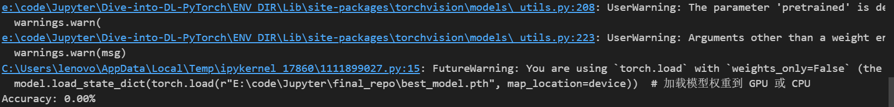

# 第一
难在数据集的获得上，一开始打算直接借助PubChemPy库进行数据获取，但是查阅使用文档没有发现可以通过"药性"特点获
得分类好的小分子，了解到PubChem网站有web服务可以用request库进行数据请求，便打算尝试获得数据，但是查阅官方文档还是不支持通过"药性"返回分子的类型。于是我就转向其他的数据库如Drugbank和ChemBl等，但是它们这些数据库的调用得注册账户并且是要收费的，于是我又转向了最初的免费的数据库PubChem。由于我会一些爬虫技术，便直接从网页端爬取得到了我所需的数据，在将数据转化后才得到现在的数据集。  
# 第二
难在模型的选择上，一开始选择用基础的CNN算法，但是了解到VGG16算法拥有更深的网络结构，能对特征进行更有效的提取，我们最终还是选择了对VGG16算法。
# 第三
难在选择模型的输出上，我们一开始打算做17个（药性）的二分类小模型，然后集成成一个大模型来判断分子的药性，但是由于我们数据集的图片含有的有效信息占比较小（大部分都是空白），二分类对于参数的改变十分有限，模型完全是停摆的状态（经过测试，正确率为0%，说明二分类输出全为否定）
于是我们想到可以直接做一个全分类的模型，模型直接输出一个17纬度的向量，最大的值就为它的药性，结果还是比较成功（假设模型完全随机，那么正确率会是5%，我们测试集的正确率能有21%）